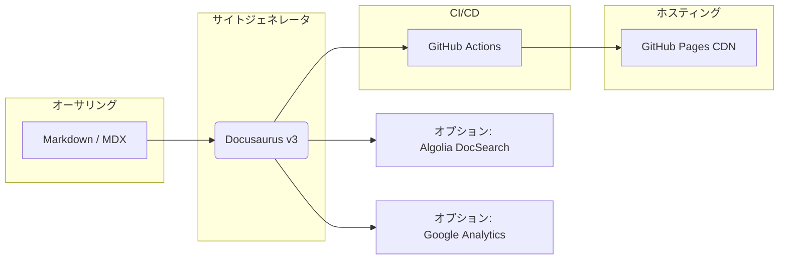

<!-- SOCIAL CARD -->


# SPO-Kissa Docs — Docusaurus × GitHub Pages

<p align="center">
  <a href="https://github.com/Sunwood-ai-labs/docusaurus-gh-pages-starter/actions/workflows/gh_actions_deploy.yml"></a>
  <a href="https://github.com/Sunwood-ai-labs/docusaurus-gh-pages-starter/releases"></a>
  <a href="LICENSE"></a>
  
  
</p>

---

## 目次

[導入メリット](#導入メリット) ｜ [主な機能](#主な機能) ｜ [クイックスタート](#クイックスタート) ｜ [アーキテクチャ](#アーキテクチャ) ｜ [リポジトリ構成](#リポジトリ構成) ｜ [カスタマイズガイド](#カスタマイズガイド) ｜ [貢献](#貢献) ｜ [ライセンス](#ライセンス)

---

## 導入メリット

| 課題                 | 従来のアプローチ                 | **Pteranodon Docs**                               |
| ------------------ | ------------------------ | ------------------------------------------------- |
| `README.md` の表現力不足 | プレーン Markdown、検索なし、移動が煩雑 | **検索・サイドバー・テーマ** を備えた Docs サイト                    |
| CI/CD の構築コスト       | Actions を 0 から記述         | **プリセット GitHub Actions** — `main` へ push → 自動デプロイ |
| 導入ハードル             | Docs 専用レポやインフラが必要        | **テンプレートリポジトリ** — ワンクリックで開始                       |
| ブランディングの一貫性        | CSS を一から実装               | **テーマトークン / Favicon 置換** で即反映                     |
| パフォーマンス最適化         | 手動で画像圧縮・キャッシュ設定          | **ベストプラクティス** が初期状態で適用                            |

---

## 主な機能

* **テンプレートをインポートするだけ** — production ready で即始動
* **TypeScript ベース設定** — `docusaurus.config.ts` で型安全に管理
* **GitHub Actions パイプライン** — ビルド・テスト・デプロイ自動化
* **Docs / Blog / 固定ページ** — 単一リポジトリで一元管理
* **i18n & バージョニング** — 規模拡大に応じてスケール
* **軽量テーマ** — メインカラーやロゴ置換は数分で完了

---

## クイックスタート

```bash
# 1) 本テンプレートからリポジトリを作成 (Use this template → Create a new repository)

# 2) ローカルで開発
$ git clone https://github.com/<ORG>/<REPO>.git
$ cd <REPO>/docs
$ npm install
$ npm start          # http://localhost:3000/

# 3) デプロイ
$ git add . && git commit -m "docs: 初期コミット"
$ git push origin main   # 数分後 → https://<ORG>.github.io/<REPO>/ に公開
```

> `docs/` フォルダは独立した Docusaurus プロジェクトです。アプリケーションコードはルートや別ディレクトリに配置できます。

---

## アーキテクチャ



---

## リポジトリ構成 (抜粋)

```text
├─ docs/                 # Docusaurus ワークスペース
│  ├─ docs/              # Markdown ドキュメント
│  ├─ blog/              # ブログ記事
│  ├─ src/               # React コンポーネント & CSS
│  ├─ static/            # 画像・Favicon・OG 画像
│  └─ docusaurus.config.ts
├─ .github/workflows/    # CI/CD 設定
└─ README.md             # このファイル
```

---

## カスタマイズガイド

| 変更したい項目                   | 対象ファイル                                      |
| ------------------------- | ------------------------------------------- |
| サイトタイトル / タグライン           | `docs/docusaurus.config.ts`                 |
| ロゴ / ソーシャルカード置換           | `docs/static/img/`                          |
| カラーパレット                   | `docs/src/css/custom.css` (`--ifm-color-*`) |
| サイドバー構成                   | `docs/sidebars.ts` またはフォルダ階層                |
| Admonition / Code Tabs など | MDX または React コンポーネント                       |

---

## 貢献

Pull Request を歓迎します。基本フロー:

1. **Fork** してブランチ作成: `git checkout -b feature/<topic>`
2. 変更をコミット (意味のあるメッセージで)
3. `npm run typecheck && npm run build` が通ることを確認
4. **Pull Request** を作成 — CI に合格すればマージされます

詳細ワークフローは [`./.claude/commands/gh-issue-workflow-from-diff-v3-lite.md`](./.claude/commands/gh-issue-workflow-from-diff-v3-lite.md) を参照してください。

---

## ライセンス

本テンプレートは [MIT License](LICENSE) の下で公開されています。

---

> *ドキュメントがプロフェッショナルなら、プロジェクトもプロフェッショナルに見える。* — Pteranodon Docs
